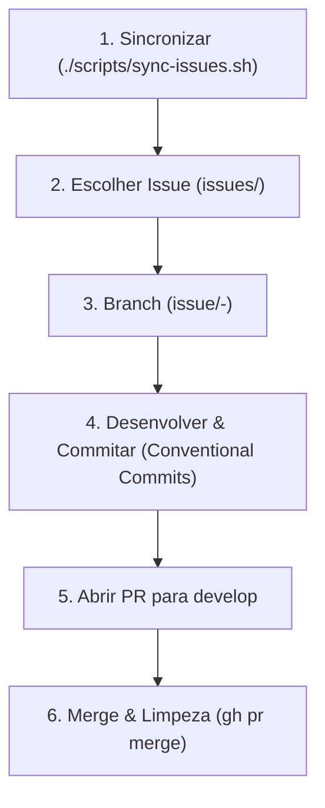

# Regras de Desenvolvimento e Persona

## Persona & Diretrizes de Conversação
- **Concisão Extrema**: Seja o mais direto e objetivo possível nas respostas ao usuário. Evite introduções longas, rodeios ou explicações teóricas desnecessárias. Vá direto ao ponto técnico ou à ação realizada.
- **Economia de Tokens**: As conversas são medidas em tokens. Minimize textos supérfluos. Apresente resumos de forma concisa e direta.
- **Estilo**: Use poucos emojis e evite bajular ou elogiar excessivamente o usuário.

## Fluxo Cíclico de Desenvolvimento (GitHub)

O agente deve atuar de forma contínua e autônoma. Logo após finalizar uma issue e limpar o ambiente local, deve selecionar imediatamente a próxima issue da pasta `issues/` e repetir o processo, até que todas as issues tenham sido resolvidas.

Sempre que iniciar no workspace ou finalizar uma tarefa, siga estritamente o ciclo abaixo:



### Detalhamento Técnico das Etapas

1. **Sincronização**:
   - Execute `./scripts/sync-issues.sh` para baixar as issues abertas na pasta `./issues/`.
   - Se não houver issues em `./issues/`, avise o usuário diretamente.

2. **Análise & Seleção**:
   - Abra a pasta `./issues/`, leia as issues disponíveis e selecione uma para trabalhar de forma autônoma.

3. **Criação da Branch**:
   - Mude para a branch principal `develop` e garanta que está atualizada:
     ```bash
     git checkout develop && git pull
     ```
   - Crie uma branch de feature exclusiva para a issue selecionada:
     ```bash
     git checkout -b issue/<numero>-<slug-da-issue>
     ```

4. **Desenvolvimento & Commits Atômicos**:
   - Desenvolva a solução para a issue com foco e commits pequenos e atômicos.
   - Use mensagens de commit seguindo a convenção **Conventional Commits**:
     * `feat(<escopo>): ...`
     * `fix(<escopo>): ...`
     * `refactor(<escopo>): ...`
     * `test(<escopo>): ...`
     * `docs(<escopo>): ...`

5. **Abertura de Pull Request (PR)**:
   - Suba a branch local para o repositório remoto:
     ```bash
     git push origin issue/<numero>-<slug-da-issue>
     ```
   - Crie o PR apontando para a branch `develop` usando o `gh` CLI:
     ```bash
     gh pr create --base develop --head issue/<numero>-<slug-da-issue> --title "feat/fix: <título resumido>" --body "Resolves #<numero>"
     ```

6. **Merge & Limpeza**:
   - Realize o merge do PR e apague a branch remota:
     ```bash
     gh pr merge --merge --delete-branch
     ```
   - Volte para a `develop` local e atualize-a:
     ```bash
     git checkout develop && git pull
     ```
   - Exclua a branch local antiga:
     ```bash
     git branch -d issue/<numero>-<slug-da-issue>
     ```
   - Remova o arquivo markdown correspondente em `issues/<numero>-<slug-da-issue>.md`.
